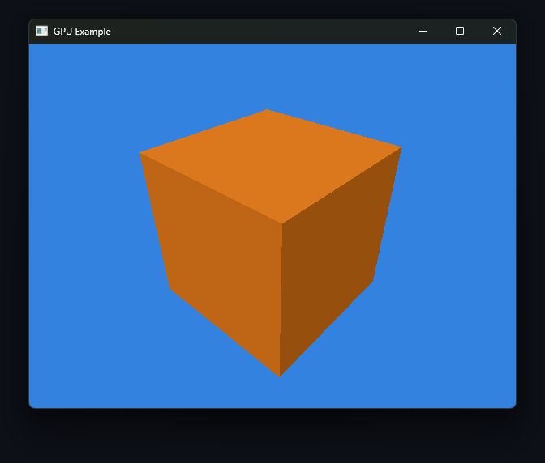

# SDL GPU Example

A minimal single-file C++ example demonstrating the SDL3 GPU API with a Phong
shading pipeline. Shaders are written in GLSL.

# Build Requirements
The following tools must be installed on your system before building:

- CMake 3.16 or newer
- A C++20 compatible compiler
- glslc (included in the Vulkan SDK)

SDL and GLM are downloaded automatically via 'FetchContent'.
